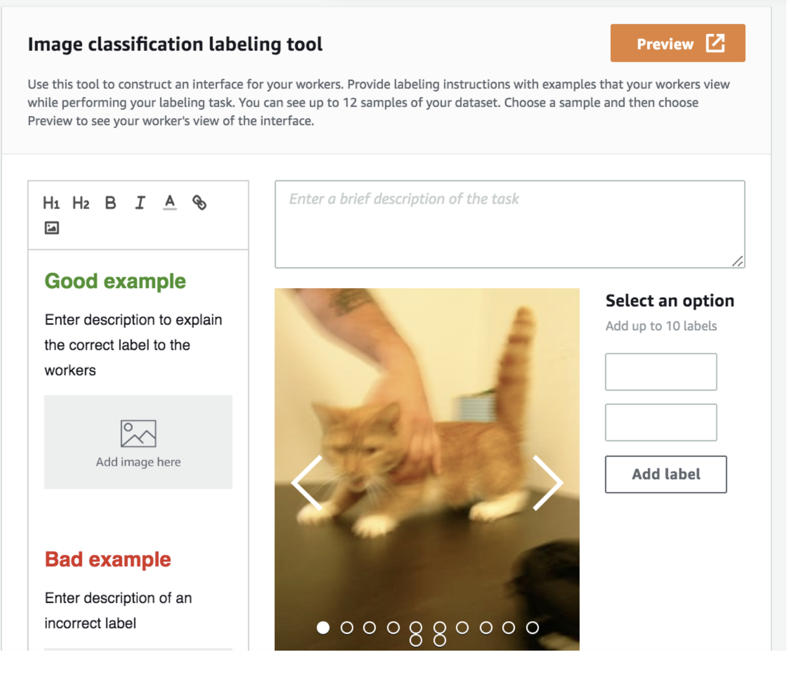
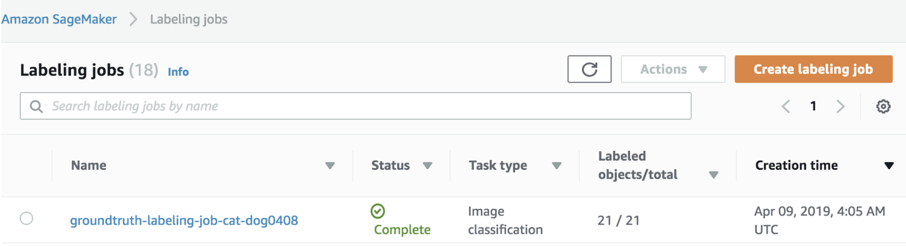

# AWS ML@Edge With NVIDIA Jetson Nano

In this project I will walkthrough how to create ML@Ede video analytics application. This will be end to end process, from data annotation, model building, training, optimization and then deploying model on edge device.

### Step 1: Data Annotation using Amazon Sagemaker GroundTruth
### Step 2: Model building, training and optimization using Sagemaker notebooks, containers and Neo
### Step 3: Deploy model on Jetson Nano using AWS IoT Greengrass
### Step 4: Visualize and analyse video analytics from the model inference on Jetson Nano

### Step 1: Data Annotation using Amazon Sagemaker GroundTruth
In this lab we will use Amazon Sagemaker GroundTruth to label images in a training dataset consisting of cat and dog images. 
You will start with an unlabeled image training data set, acquire labels for all the images using SageMaker Ground Truth private workforce and finally analyze the results of the labeling job.

High Level Steps 

1.	Upload training data into an S3 bucket.
2.	Create a private Ground Truth Labeling workforce.
3.	Create a Ground Truth Labeling job
4.	Label the images using the Ground Truth Labeling portal.
5.	Analyze results

### 1.	Upload training data into an S3 bucket.

In this step you will first create an Amazon S3 bucket where you will store the training data.  You will then download the training data consisting of cat & dog images and then upload to the S3 bucket created. 

#### 1.1	 Create an S3 bucket.

In this step you will create an Amazon S3 bucket where you will store the training data.

* Sign into AWS Management Console.
* Search for and choose S3 to open the Amazon S3 console.
* From the Amazon S3 console dashboard, choose Create Bucket.
* In Create Bucket wizard
    - On the ‘Name and region’ Step
      - Type a bucket name in Bucket Name. (For eg., ground-truth-labelling-job-initials-date; Note that this name should be unique across all AWS)
      - Select ‘US East’ as the region. 
      - Click ‘Next’
  - On the ‘Configure Options’ Step
      - Leave defaults and Click ‘Next’
  - On the ‘Set Permissions’ Step
    Uncheck the four checkboxes on this screen that block public access to the data.
      - Click ‘Next’
      - On the ‘Review’ Step, click 'Next', create bucket.

#### 1.2	 Download the training data.

In this step you will download the training data to your local machine.

* Download the training data (cat & dog images) from this link
https://s3.amazonaws.com/groundtruth-ml-roadshow-workshop/traindata_cat_dog_images_20.zip

* Extract the traindata_cat_dog_images_20.zip, if necessary.  You should see “traindata_cat_dog_images_20” folder with about 20 files.

#### 1.3	 Upload training data to the S3 bucket.

In this step you will upload the training data to the Amazon S3 bucket created in Step 1.1.  

* Upload the training data to the S3 bucket.
  -	From the Amazon S3 console, click on the S3 bucket created in the above step.  
  -	Click Upload
  -	In the Upload Wizard
    -	On the first step ‘Select files’
* Drag/Drop the ‘traindata_cat_dog_images_20’ folder from your local machine
  - Click Next
* On the ‘Set Permissions’ step
  - Leave defaults and click ‘Next’
  - On the ‘Set properties’ step
* Leave defaults and click ‘Next’
  - On the ‘Review’ step
* Review and click ‘Upload
* You will see the progress bar for the upload.
* Wait till upload is complete.

#### 1.4	(Optional step) Make sample images public.

When configuring Ground Truth Labeling job, you need to provide good and bad examples.  For this the image files in S3 bucket need to made publicly accessible.
* In the S3 bucket, click traindata_cat_dog_images_20’  100.jpg and click ‘Make Public’.  Make note the object url https://s3.amazonaws.com/<bucket-name>/traindata_cat_dog_images_20/100.jpg

* In the S3 bucket, click traindata_cat_dog_images_20’  199.jpg and click ‘Make Public’. Make note the object url https://s3.amazonaws.com/<bucket-name>/traindata_cat_dog_images_20/199.jpg

#### 1.5	Create a private Ground Truth Labeling Workforce.
In this step, you will create a “private workteam” and add only one user (you) to it. 

To create a private team:

*	Go to AWS Console > Amazon SageMaker > Labeling workforces
  - Click "Private" tab and then "Create private team".
  - Enter the desired name for your private workteam.
  - Enter your own email address in the "Email addresses" section.
  - Enter the name of your organization.
  - Enter contact email to administrate the private workteam.
  - Click "Create Private Team".
* The AWS Console should now return to AWS Console > Amazon SageMaker > Labeling workforces. Your newly created team should be visible under "Private teams". 
  - You should get an email from `no-reply@verificationemail.com` that contains your workforce username and password.
  - Use the link and login credentials from the email to access the Labeling portal.
  - You will be asked to create a new, non-default password

That's it! This is your private worker's interface.
Once the Ground Truth labeling job is submitted in the next step, you will see the annotation job in this portal.

#### 1.6 Create a private Ground Truth Labeling Job.
In this step, you will create a Ground Truth Labeling job and assign it to the private workforce created in Step 3.

* Go to AWS Console > Amazon SageMaker > Labeling jobs
* Click ‘Create labeling job’
* In ‘Specify job details’ step
* Job name : groundtruth-labeling-job-cat-dog (Note : Any unique name will do)
* Input dataset location 
* Create manifest
  - Entire S3 path where images are located. (Note : should end with /; For eg : s3://<bucketname>/<prefix/foldername>/)
  - Select 'Images' as data type
  - Wait till the manifest creation is complete.
  - Click "Use this manifest"
* Output dataset location : Enter S3 bucket path
  (For eg : s3://<bucketname>/<prefix/foldername>/)
*	IAM Role
  - Select 'Create a new role' from the dropdown.
  - In the “Specific S3 buckets” section, enter the S3 bucket created in Step 1 
  - Click Create
*	Task Type
*	Select 'Image classification'
*	Click Next
  -	In 'Workers' Step
    - Select ‘Private’
    - Select the team created in previous step from the Private teams dropdown.  
    - Examine ‘Additional configuration’ options
    - Leave ‘Automated data labeling’  ‘Enable’ unchecked.
    - Leave ‘Number of workers per dataset object’ at 1
    - In 'Image classification labeling tool' Step
 
 

*	Enter "Please classify the images as 'cat' or 'dog' " in the textbox as an instruction to the workforce.
  - Add two Options 'cat' or 'dog'
  - For Good example and Bad example, add links of the public image urls noted in 1.3 section.
  -	Submit
*	Go to AWS Console > Amazon SageMaker > Labeling jobs to verify that a labeling job has been created.

#### 1.7 Label the images using the Ground Truth Labeling portal

In this step, you will complete a labeling/annotation job assigned to you from the  Ground Truth Labeling portal.  
*	Login to the Ground Truth Labeling portal using the link provided to you in the email from `no-reply@verificationemail.com`.

Once the annotation job is assigned, you can view the job (similar to the picture below)

 
*	Click ‘Start working’
*	You will start seeing the images that need to be labeled.  For each image, select cat/dog in the option and click ‘Submit’

Note : After labeling a subset of images, the annotation job will be complete.  If the first annotation job did not include all 20 images, you will see a new job in the portal after a few minutes. Repeat the process of labeling images in the jobs as they appear in the portal, till all images are labelled.  You can check the status of the labeling job from the Ground Truth  Labeling Jobs, which will show you the number of images labeled out of the total images.

#### 1.8.	Analyze Results

In this step, you will review the manifest files created during the Ground Truth Labeling process.  The manifest files are in the S3 bucket you created in Step 1.

Input Manifest File

Located in S3 bucket in the prefix : traindata_cat_dog_images_20/dataset-xxxxxx.manifest.

The manifest is a json file that captures information about the training data.

Sample :

{"source-ref":"s3://ground-truth-labelling-job-sm/traindata_cat_dog_images_20/0.jpg"}
{"source-ref":"s3://ground-truth-labelling-job-sm/traindata_cat_dog_images_20/10.jpg"}
{"source-ref":"s3://ground-truth-labelling-job-sm/traindata_cat_dog_images_20/100.jpg"}
{"source-ref":"s3://ground-truth-labelling-job-sm/traindata_cat_dog_images_20/110.jpg"}
{"source-ref":"s3://ground-truth-labelling-job -sm/traindata_cat_dog_images_20/120.jpg"}
{"source-ref":"s3://ground-truth-labelling-job-sm/traindata_cat_dog_images_20/130.jpg"}
{"source-ref":"s3://ground-truth-labelling-job-sm/traindata_cat_dog_images_20/140.jpg"}
…

Output Manifest File

Located in S3 bucket in the prefix : <labeling-job-name>/manifests/output.manifest

The manifest is a json file that captures metadata about each labeled image. 

Sample: 

{"source-ref":"s3://ground-truth-labelling-job-sm/traindata_cat_dog_images_20/0.jpg","groundtruth-labeling-job-cat-dog0408":0,"groundtruth-labeling-job-cat-dog0408-metadata":{"confidence":0.51,"job-name":"labeling-job/groundtruth-labeling-job-cat-dog0408","class-name":"cat","human-annotated":"yes","creation-date":"2019-04-09T04:21:19.914807","type":"groundtruth/image-classification"}}
{"source-ref":"s3://ground-truth-labelling-job-sm/traindata_cat_dog_images_20/10.jpg","groundtruth-labeling-job-cat-dog0408":0,"groundtruth-labeling-job-cat-dog0408-metadata":{"confidence":0.9,"job-name":"labeling-job/groundtruth-labeling-job-cat-dog0408","class-name":"cat","human-annotated":"yes","creation-date":"2019-04-09T04:29:57.698312","type":"groundtruth/image-classification"}}
{"source-ref":"s3://ground-truth-labelling-job-sm/traindata_cat_dog_images_20/100.jpg","groundtruth-labeling-job-cat-dog0408":0,"groundtruth-labeling-job-cat-dog0408-metadata":{"confidence":0.75,"job-name":"labeling-job/groundtruth-labeling-job-cat-dog0408","class-name":"cat","human-annotated":"yes","creation-date":"2019-04-09T04:28:53.932313","type":"groundtruth/image-classification"}}
….

Along with the other metadata information, the output manifest shows the identified class of the image and confidence.  

