# AWS ML@Edge with NVIDIA Jetson Nano

In this project I will walkthrough how to create ML@Edge video analytics application. This will be end to end process, from data annotation, model building, training, optimization and then deploying model on edge device NVIDIA Jetson Nano.

### Step 1: Data Annotation using Amazon SageMaker GroundTruth
### Step 2: Model building, training and optimization using SageMaker notebooks, containers and Neo
### Step 3: Deploy model on Jetson Nano using AWS IoT Greengrass
### Step 4: Visualize and analyze video analytics from the model inference on Jetson Nano


Let's start with Step 1:

### Step 1: Data Annotation using Amazon SageMaker GroundTruth
In this lab we will use Amazon SageMaker GroundTruth to label images in a training dataset consisting of Lego Dinosaurs images. 
You will start with an unlabeled image training data set, acquire labels for all the images using SageMaker Ground Truth private workforce and finally analyze the results of the labeling job.

High Level Steps:

1.	Upload training data into an S3 bucket.
2.	Create a private Ground Truth Labeling workforce.
3.	Create a Ground Truth Labeling job
4.	Label images using the Ground Truth Labeling portal.
5.	Analyze results

### 1.	Upload training data into an S3 bucket.

In this step you will first create an Amazon S3 bucket where you will store the training data.  You will then download the training data consisting Lego Dinosaurs images and then upload this dataset to the S3 bucket created. 

#### 1.1	 Create an S3 bucket.

In this step you will create an Amazon S3 bucket where you will store the training data.

* Sign into AWS Management Console.
* Search for and choose S3 to open the Amazon S3 console.
* From the Amazon S3 console dashboard, choose Create Bucket.
* In Create Bucket wizard
    - On the ‘Name and region’ Step
      - Type a bucket name in Bucket Name. (For e.g., ground-truth-labelling-job-initials-date; Note that this name should be unique across all AWS)
      - Select ‘US East’ as the region. 
      - Click ‘Next’
  - On the ‘Configure Options’ Step
      - Leave defaults and Click ‘Next’
      - On the ‘Review’ Step, click 'Next', create bucket.

#### 1.2	 Download the training data.

In this step you will download the training data to your local machine.
I have created Lego Dinosaurs dataset, it has about 388 files of 6 dinosaurus classes. Brachiosaurus, Dilophosaurus, Spinosaurus, Stegosaurus, Triceratops and Unknown dinosaurs.

* Download the training data (lego dinosaurs images) from this link
https://sagemaker-nvidia-webinar.s3.amazonaws.com/lego_dinosaurs_dataset.zip

* Extract the lego_dinosaurs_dataset.zip, if necessary.  You should see “lego_dinosaurs_dataset” folder with about 388 files.


#### 1.3	 Upload training data to the S3 bucket.

In this step you will upload the training data to the Amazon S3 bucket created in Step 1.1.  

* Upload the training data to the S3 bucket.
  -	From the Amazon S3 console, click on the S3 bucket created in the above step.  
  -	Click Upload
  -	In the Upload Wizard
    -	On the first step ‘Select files’
* Drag/Drop the ‘lego_dinosaurs_dataset’ folder from your local machine
  - Click Next
* On the ‘Set Permissions’ step
  - Leave defaults and click ‘Next’
  - On the ‘Set properties’ step
* Leave defaults and click ‘Next’
  - On the ‘Review’ step
* Review and click ‘Upload
* You will see the progress bar for the upload.
* Wait till upload is complete.

#### 1.4 Create a private Ground Truth Labeling Workforce.
In this step, you will create a “private workteam” and add only one user (you) to it. 

To create a private team:

*	Go to AWS Console > Amazon SageMaker > Labeling workforces
  - Click "Private" tab and then "Create private team".
  - Enter the desired name for your private workteam.
  - Enter your own email address in the "Email addresses" section.
  - Enter the name of your organization.
  - Enter contact email to administrate the private workteam.
  - Click "Create Private Team".
* The AWS Console should now return to AWS Console > Amazon SageMaker > Labeling workforces. Your newly created team should be visible under "Private teams". 
  - You should get an email from `no-reply@verificationemail.com` that contains your workforce username and password.
  - Use the link and login credentials from the email to access the Labeling portal.
  - You will be asked to create a new, non-default password

That's it! This is your private worker's interface.
Once the Ground Truth labeling job is submitted in the next step, you will see the annotation job in this portal.


#### 1.5 Create a private Ground Truth Labeling Job.
In this step, you will create a Ground Truth Labeling job and assign it to the private workforce.

* Go to AWS Console > Amazon SageMaker > Labeling jobs
* Click ‘Create labeling job’
* In ‘Specify job details’ step
* Job name : groundtruth-labeling-job-lego_dinosaurs (Note : Any unique name will do)
* Input dataset location 
* Create manifest
  - Entire S3 path where images are located. (Note : should end with /; For e.g. : s3://<bucketname>/<prefix/foldername>/)
  - Select 'Images' as data type
  - Wait till the manifest creation is complete.
  - Click "Use this manifest"
* Output dataset location : Enter S3 bucket path
  (For eg : s3://<bucketname>/<prefix/foldername>/)
*	IAM Role
  - Select 'Create a new role' from the dropdown.
  - In the “Specific S3 buckets” section, enter the S3 bucket created in Step 1 
  - Click Create
*	Task Type
*	Select 'Image classification'
*	Click Next
  -	In 'Workers' Step
    - Select ‘Private’
    - Select the team created in previous step from the Private teams dropdown.  
    - Examine ‘Additional configuration’ options
    - Leave ‘Automated data labeling’ - ‘Enable’ unchecked.
    - Leave ‘Number of workers per dataset object’ at 1
    - In 'Image classification labeling tool' Step
 
*	Enter "Please classify the images as  Brachiosaurus, Dilophosaurus, Spinosaurus, Stegosaurus, Triceratops and Unknown in the textbox as an instruction to the workforce.
  - Add six Options  Brachiosaurus, Dilophosaurus, Spinosaurus, Stegosaurus, Triceratops and Unknown
  - For Good example and Bad example, add links of the public image urls. This is optional
  -	Submit
*	Go to AWS Console > Amazon SageMaker > Labeling jobs to verify that a labeling job has been created.

#### 1.6 Label the images using the Ground Truth Labeling portal

In this step, you will complete a labeling/annotation job assigned to you from the  Ground Truth Labeling portal.  
*	Login to the Ground Truth Labeling portal using the link provided to you in the email from `no-reply@verificationemail.com`.

Once the annotation job is assigned, you can view the job (similar to the picture below)

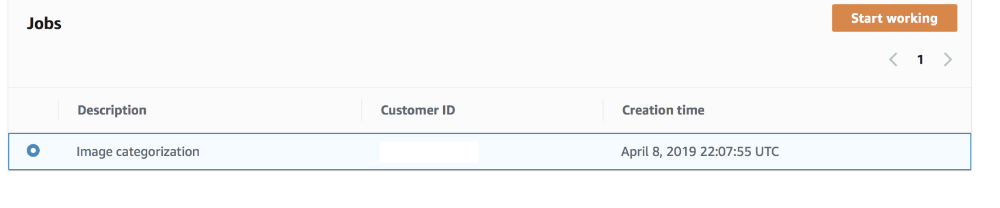
 
*	Click ‘Start working’
*	You will start seeing the images that need to be labeled.  For each image, select  Brachiosaurus, Dilophosaurus, Spinosaurus, Stegosaurus, Triceratops and Unknown in the option and click ‘Submit’

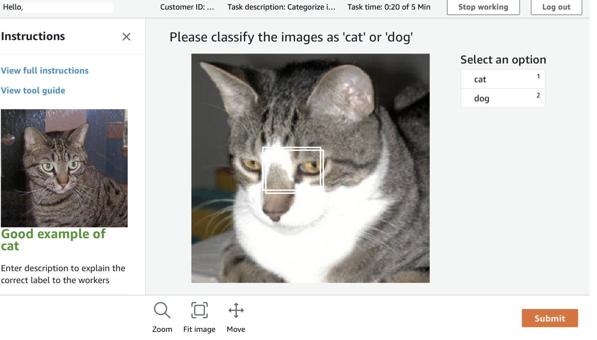

Note : After labeling a subset of images, the annotation job will be complete.  If the first annotation job did not include all images, you will see a new job in the portal after a few minutes. Repeat the process of labeling images in the jobs as they appear in the portal, till all images are labelled.  You can check the status of the labeling job from the Ground Truth  Labeling Jobs, which will show you the number of images labeled out of the total images.

#### 1.7.	Analyze Results

In this step, you will review the manifest files created during the Ground Truth Labeling process.  The manifest files are in the S3 bucket you created in Step 1.

Input Manifest File

Located in S3 bucket in the prefix : lego_dinosaurs_dataset/dataset-xxxxxx.manifest.

The manifest is a json file that captures information about the training data.

Sample :

{"source-ref":"s3://dino-dataset/lego_dinosaurs_dataset/3_Triceratops_084.jpg"}
{"source-ref":"s3:/dino-dataset/lego_dinosaurs_dataset/5_NoDino_245.jpg"}
{"source-ref":"s3://dino-dataset/lego_dinosaurs_dataset/0_Spinosaurus_111.jpg"}
…


Output Manifest File

Located in S3 bucket in the prefix : <labeling-job-name>/manifests/output.manifest

The manifest is a json file that captures metadata about each labeled image. 

Sample: 

{"source-ref": "s3://dino-dataset/3_Triceratops_084.jpg", "dino-image-classification": 3, "dino-image-classification-metadata": {"confidence": 0.94, "job-name": "labeling-job/dino-image-classification", "class-name": "3_Triceratops", "human-annotated": "yes", "creation-date": "2019-05-25T08:54:54.133410", "type": "groundtruth/image-classification"}}
{"source-ref": "s3://dino-dataset/5_NoDino_245.jpg", "dino-image-classification": 5, "dino-image-classification-metadata": {"confidence": 0.95, "job-name": "labeling-job/dino-image-classification", "class-name": "5_Unknown", "human-annotated": "yes", "creation-date": "2019-05-25T08:37:55.495129", "type": "groundtruth/image-classification"}}
{"source-ref": "s3://dino-dataset/0_Spinosaurus_111.jpg", "dino-image-classification": 0, "dino-image-classification-metadata": {"confidence": 0.68, "job-name": "labeling-job/dino-image-classification", "class-name": "0_Spinosaurus", "human-annotated": "yes", "creation-date": "2019-05-25T08:58:35.374405", "type": "groundtruth/image-classification"}}
{"sourc
….

Along with the other metadata information, the output manifest shows the identified class of the image and confidence.  

Now we need to build model, train model and optimize model.

### Step 2: Model building, training and optimization using SageMaker notebooks, containers and Neo
Model building, training and optimization is simplified by SageMaker notebooks, training container and Neo.
All these steps can be done using single notebook. Please follow attached notebook 
[SageMaker notebook](sagemaker_image_classification.ipynb). Download this notebook and upload it to your SageMaker environment. To create SageMaker notebook environment, please follow this [guide](https://github.com/awslabs/amazon-sagemaker-workshop/tree/master/NotebookCreation) 

One of the nice features of of jupyter notebook is that it can contains code as well as comments. I will use the notebook to explain model building, training and optimization.

Now that model is build and optimized, now we can deploy this model on NVIDIA Jetson Nano using AWS IoT Greengrass

### Step 3: Deploy model on Jetson Nano using AWS IoT Greengrass
This step will need
- 3.1 Installing SageMaker Neo runtime
- 3.2 Installing AWS IoT Greengrass 
- 3.3 Setup and configure Inference code using AWS Lambda
- 3.4 Set machine leaning at edge deployment
- 3.5 Deploy machine learning at edge on NVIDIA Jetson Nano
- 3.6 Run model, check inference

#### 3.1 Installing SageMaker Neo runtime
SageMaker Neo Runtime aka SageMaker Neo DLR is a runtime library that helps run models compiled using SageMaker Neo in the cloud. In our model training step, last step is to compile model using SageMaker Neo. In following steps we will install SageMaker Neo Runtime.
- Go to SageMaker Neo git https://neo-ai-dlr.readthedocs.io/en/latest/install.html
- Check step under "Installing Pre-built DLR Wheels for Your Device"
- You can install SageMaker Neo using  "sudo pip install  'link-to-matching-wheel-on-S3'"
- link-to-matching-wheel-on-S3 is for Jetson Nano, look for link such as https://s3-us-west-2.amazonaws.com/neo-ai-dlr-release/v1.0/jetsonnano-aarch64-cu10-ubuntu18_04-glibc2_27-libstdcpp3_4/dlr-1.0-py2.py3-none-any.whl
- Download this .whl file
- log into Jetbot dekstop or SSH to jetbot.  Install this .whl file using command such as 
```
sudo pip install dlr-1.0-py2.py3-none-any.whl
```

- also install AWS Python SDK boto3, this is needed for Greengrass Lambda code to send custom metrics to CloudWatch
```
sudo pip install boto3
```

#### 3.2 Installing AWS IoT Greengrass 

First setup Setup your Jetson Nano Developer Kit with the SD card image.

Run the following commands on your Nano to create greengrass user and group:

```
$ sudo adduser --system ggc_user
$ sudo addgroup --system ggc_group
```

Setup your AWS account and Greengrass group using this page: https://docs.aws.amazon.com/greengrass/latest/developerguide/gg-config.html
After downloading your unique security resource keys to your Jetson that were created in this step, proceed to step below. If you created and downloaded these keys on machine other than Jetson Nano then you will need to copy these to Jetson Nano. You can use SCP to transfer files from your desktop to Jetson Nano.

Download the AWS IoT Greengrass Core Software (v1.9.1) for ARMv8 (aarch64):

```
$ wget https://d1onfpft10uf5o.cloudfront.net/greengrass-core/downloads/1.9.1/greengrass-linux-aarch64-1.9.1.tar.gz
```

Following this page (starting with step #4 from that page), extract Greengrass core and your unique security keys on your Nano:

```
$ sudo tar -xzvf greengrass-linux-aarch64-1.9.1.tar.gz -C /
$ sudo tar -xzvf <hash>-setup.tar.gz -C /greengrass   # these are the security keys downloaded above
```

Download AWS ATS endpoint root certificate (CA):

```
$ cd /greengrass/certs/
$ sudo wget -O root.ca.pem https://www.amazontrust.com/repository/AmazonRootCA1.pem
```

Start greengrass core on your Nano:

```
$ cd /greengrass/ggc/core/
$ sudo ./greengrassd start
```

You should get a message in your terminal "Greengrass successfully started with PID: xxx"

#### 3.3 Setup and configure Inference code using AWS Lambda

Go to [AWS Management console](https://console.aws.amazon.com/console/home?region=us-east-1) and search for Lambda

Click 'Create function'

Choose 'Blueprints'

In the search bar, type “greengrass-hello-world” and hit Enter

Choose the python blueprint and click Configure

Name the function: e.g. interface-lambda
Role: Choose an existing role
[Note: You may need to create new role, give basic execution permissions, choose default)

Click Create Function
Replace the default script with the [inference script](inference-lambda.py)

#### 3.4  Set machine leaning at edge deployment
- Go to [AWS Management console](https://console.aws.amazon.com/console/home?region=us-east-1) and search for Greengrass
- Go to AWS IoT Greengrass console
- Choose the greengrass group you created in step 3.2
- Select lambda, choose lambda function you created in 3.3
- make it the lambda long running per doc ![https://docs.aws.amazon.com/greengrass/latest/developerguide/long-lived.html]
(https://docs.aws.amazon.com/greengrass/latest/developerguide/long-lived.html)

- In memory, set it to 700mb+
- In resources, add ML model as per below 
, Select S3 bucket where optimized model (i.e. SageMaker Neo compiled) is located. Select bucket first from dropdown box and then model file
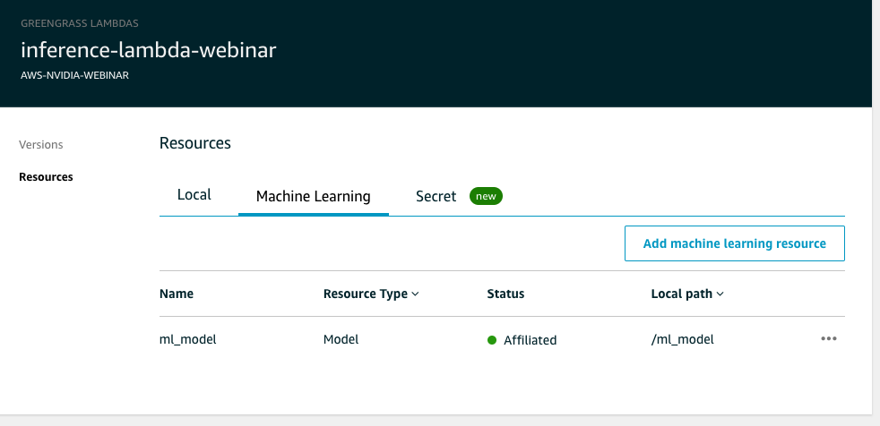
- In lambda - under Resources, select "local", we will now setup local resource access. This is the access Lambda needs in order to access local resources such as temp folder, shared memory, shared cache etc. Please follow screenshot below
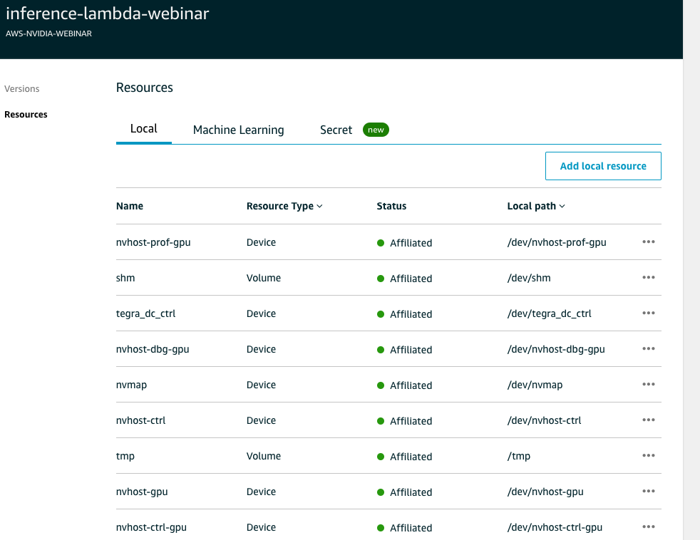
**** Screenshot is not complete ****
make sure you add following resources

- /dev/nvhost-prof-gpu resource type "Device"
- /dev/shm resource type "Volume"
- /dev/tmp resource type "Volume"
- /dev/nvhost-vi resource type "Device"
- /dev/nvhost-vic resource type "Device"
- /dev/nvhost-nvmap resource type "Device"
- /dev/nvhost-dbg-gpu resource type "Device"
- /dev/nvhost-gpu resource type "Device"
- /dev/nvhost-ctrl-gpu resource type "Device"
- /dev/tegra-dc-ctrl resource type "Device"
- /dev/nvmap resource type "Device"
- /dev/video0 or /dev/video1 if you use USB camera

- Setup Greengrass role: go to "Settings" menu on left menu items, this will open Greengrass settings. Check top part that says "Group role", select Greengrass service role. Go to AWS IAM console, go to roles, select the greengrass role and add "AmazonS3fullAccess", "CloudWatchFullAccess" and "AWSGreengrassResourceAccessRolePolicy" .. per screenshot below
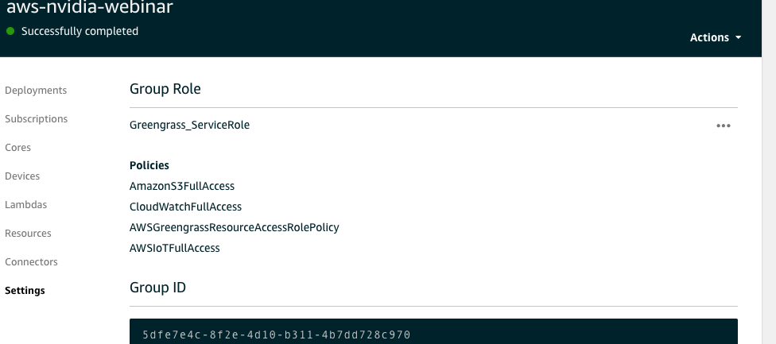
- Setup Greengrass logs
Under "Settings", scroll down, you will see option to setup log level. Setup Greengrass and lambda logs to info-level logs per screenshot below
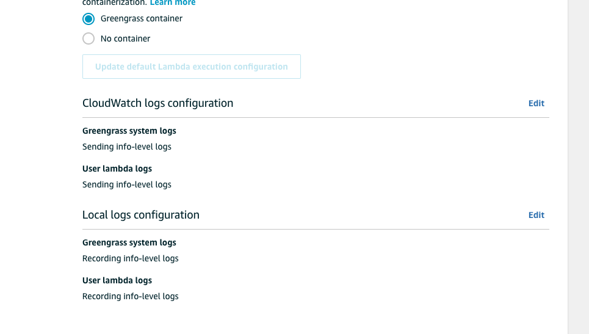

#### 3.5 Deploy machine learning at edge on NVIDIA Jetson Nano
- Go back to AWS IoT Greengrass console
- We will need to send messages from NVIDIA Jetson to cloud. so, we need to setup message subscription per screenshot below.
Choose "subscription" menu from left menu items, choose "source" as your lambda function and destination as "IoT Cloud", topic as one in the lambda code i.e. "dino-detect". This will route messages from lambda to IoT Cloud i.e. AWS IoT. 
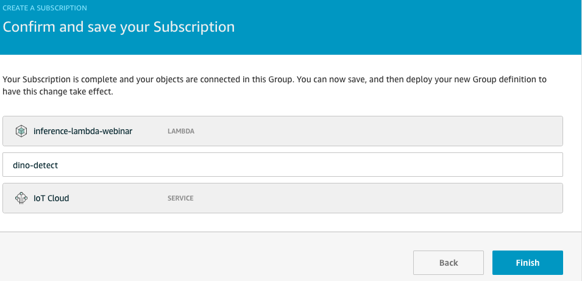
- Now we are ready to deploy model, lambda and configuration.
- From Actions menu on top right side, select "Deploy"
- This will take few minutes to download and deploy model
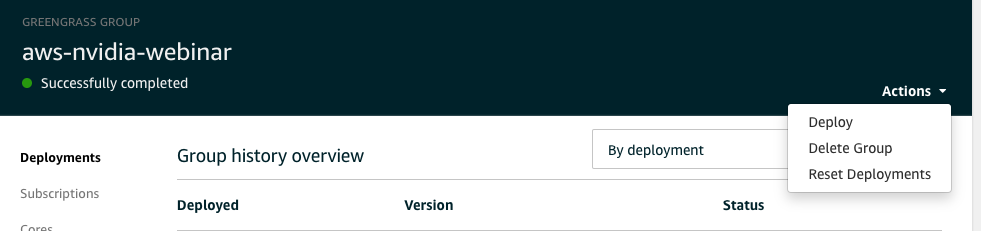

#### 3.6 Check inference
- Go to [AWS Management console](https://console.aws.amazon.com/console/home?region=us-east-1) and search for Greengrass
- Go to AWS IoT console
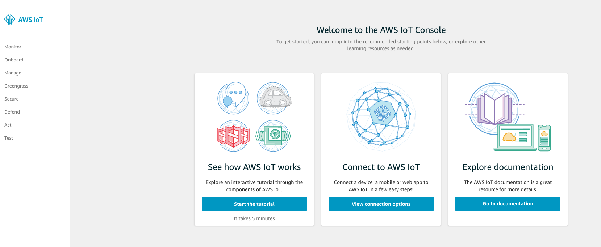
- Select Test from left menu
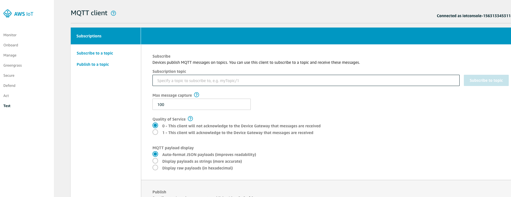
- Add "#" in Subscribe topic, click Subscribe. This will subscribe to all IoT topics coming to Jetson Nano
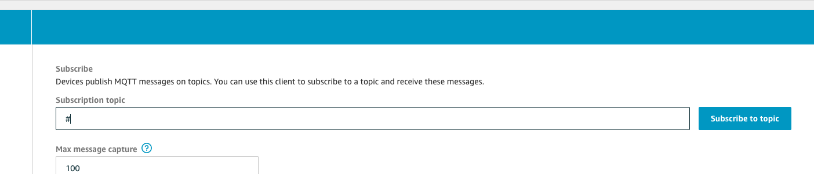
- In Subscription box you will start seeing IoT messages coming from Jetson nano

#### 3.7 Troubleshooting
- Error logs are recorded in CloudWatch, you can log into AWS CloudWatch and check for greengrass errors
- Lambda user error logs on device are located at /greengrass/ggc/var/log/user and then your region, account number, then you will see log file named after your lambda e.g. inference-lambda.log
- Greengrass system logs are on device at /greengrass/ggc/var/system. There are many logs, runtime log is imp
- if you get any error related to camera buffer then please run command "sudo systemctl restart nvargus-daemon" to restart related process.
- to start and stop greengrass,  cd to /greengrass/ggc/core and then ./greengrassd start to start and ./greengrassd to stop


### Step 4: Visualize and analyze video analytics from the model inference on Jetson Nano
The lambda code running on NVIDIA Jetson Nano device sends IoT messages back to cloud. These messages are sent to AWS CloudWatch. CloudWatch has built-in dashboard. We will use the built in dashboard to visualize data coming from the device.

Go to [AWS Management console](https://console.aws.amazon.com/console/home?region=us-east-1) and search for Cloudwatch

Create a dashboard called “aws-nvidia-jetson-nano-dashboard-your-name”

Choose Line in the widget

Under Custom Namespaces, select “string”, “Metrics with no dimensions”, and then select all metrics.

Next, set “Auto-refresh” to the smallest interval possible (1h), and change the “Period” to whatever works best for you (1 second or 5 seconds)

You will see analysis on number of times different dinosaurs detected by NVIDIA Jetson Nano

NOTE: These metrics will only appear once they have been sent to Cloudwatch via the Lambda code running on edge. It may take some time for them to appear after your model is deployed and running locally. If they do not appear, then there is a problem somewhere in the pipeline.


### With this we have come to the end of the session. As part of building this project, you learnt the following:

1.	How to create and annotate dataset for computer vision based model using Amazon SageMaker GroundTruth
2.  How to build, train and optimize model in Amazon SageMaker
3.	Setup and configure AWS IoT Greengrass 
4.	Deploy the inference lambda function and model on NVIDIA Jetson Nano
5.	Analyze model inference data using AWS CloudWatch
